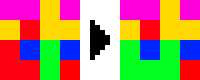

Conquest
===

A game for 1-6 players where the objective is to capture the most tiles. The winner is decided when there are no 'neutral' tiles left.

## How to play:
### **Starting positions**
The game starts with player 1 in the bottom left corner, player 2 in the opposite corner, player 3 in the top left corner and so on...  

### **Turn** 
Every turn, the turn player chooses a color from the tiles below the board. Their tiles change to that color.
The turn player can't choose any of the colors the other players control, or the one they already control.

Every tile adjacent to tiles of the same color as the players newly changed tiles are now considered that players tiles and they cannot be captured by other players.

In this example image, the turn player (red) chooses the green tile. The turn player now owns all the continous green tiles.

The next player starts their turn.

### **End**
Once all the tiles are in control of players, the game decides the winner based on the most tiles controlled by a player. The winners score display begins to blink. The amount of turns played appears on the color bar above the board.
In the case of a tie, the last player in the turn order wins.

## How to setup
### Singleplayer:
 - Run the server exe
 - Run the client exe
 - Focus the client window and press 'R' (ready)
    - The server sends the board data to the client
 - You should now be able to click a tile
### Multiplayer:
 - Run the server exe
 - Run the client exes (2-6 players)
 - Focus a client window and press 'R' (ready), do this for all the clients
    - The turn order is dictated by the order of ready commands received
    - The server sends the board data to each client
 - Focus a client window and press 'O' (create_game)
    - The server creates a new game with the amount of ready players
 - You should now be able to click a tile with the first client
### AI:
 - Run the server exe
 - Run the client exes
 - Focus a client window and press 'R' (ready), do this for all the clients
    - The turn order is dictated by the order of ready commands received
 - The server sends the board data to each client
 - Focus a client window and press 'O' (create_game)
    - The server creates a new game with the amount of ready players
 - Focus a client you want the AI to control and press 'A' (ai) to enable the AI
 - You should now be able to click a tile with the first client
 - You might need to pick the first tile for the ai manually
 - The AI always selects the color with most valid adjacent tiles available

## IP config for local network multiplayer
 - IP config files are found under 'config/' in both client and server directories.
 - Modify the net.txt files:
    - Server:
        - First line is the server pc's ip/port
    - Client:
        - First line is the server pc's ip/port 
        - Second line is the clients ip/port

## Full client controls
  - '1'-'0' : Change the display color of an individual tile 
  - 'K' : Change the display color of all the tiles (**seizure warning**)
  - 'A' : Enable AI control
  - 'R' : Ready
  - 'O' : Create a new game
  - 'D' : Drop all players from the server
  - 'ESC' : Safely exit the client, same as pressing x top right
  - 'F1' : Print FPS to console

## Other configs
 - Server:
    - Map config:
       - nr_colors on the first row, default: 5
       - Mapsize x y on the second, default: 40 * 32, max: x * y <= 4000, 80 is the hard limit for one dimension
 - Client:
    - Video config:
       - Tilesize in pixels, default: 20, needs to be set to lower if map is a lot bigger than default

